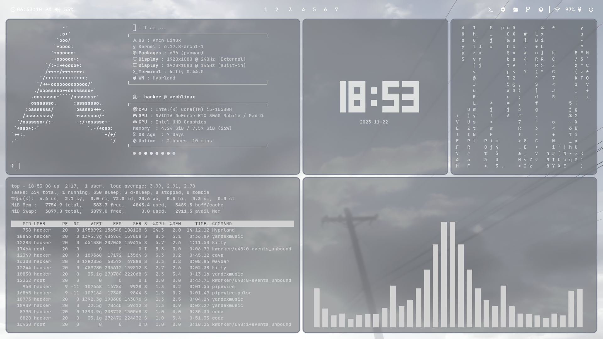

# Minimalist Hyprland Rice

Welcome to my Minimalist Hyprland Rice configuration! This setup is designed for those, who love minimalism and stable work.

## Required dependencies

- **Window Manager**: [Hyprland](https://github.com/hyprwm/Hyprland) - A dynamic tiling compositor.
- **Compositor**: Wayland for smooth and modern graphics.
- **Terminal**: [Kitty](https://sw.kovidgoyal.net/kitty/) - A fast, popular and customizable terminal.
- **Launcher**: [Wofi](https://hg.sr.ht/~scoopta/wofi) - A modern application launcher.
- **Bar**: [Waybar](https://github.com/Alexays/Waybar) - A popular and highly customizable status bar.
- **Notifications**: [Mako](https://github.com/emersion/mako) - A lightweight Wayland notification tool.
- **Color Scheme Generator**: [Pywal16](https://github.com/adi1090x/pywal16) - A tool to generate and apply color schemes based on your wallpaper on terminal-apps and status bar.

## Screenshots




## Installation

1. Clone this repository:
    ```bash
    git clone https://github.com/miroshantoshan/Minimalist-Dots
    cd Invincible-Dots
    ```

2. Install the required dependencies:
    ```bash
    sudo pacman -S hyprland kitty wofi waybar mako zsh ttf-jetbrains-mono ttf-jetbrains-mono-nerd hyprpaper
    yay -S python-pywal16
    ```

3. Copy the configuration files to their manual locations:
    ```bash
    cp -r .config/* ~/.config/
    ```

4. Restart your session and enjoy your new setup!

## Customization

You can customize the configuration files in the `~/.config` directory to suit your preferences.

Enjoy your Minimalist Hyprland rice!


